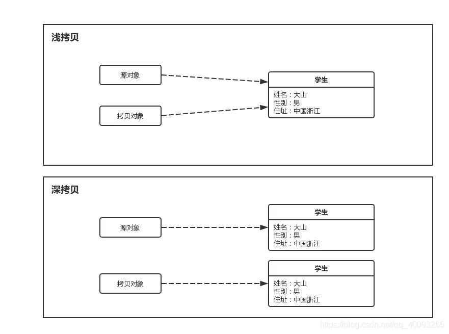

# Java基础
## 概念部分
### Java特点
* 平台无关性
* 面向对象
* 内存管理
### Java跨平台
Java跨平台依赖于JVM (Java Virtual Machine)  
JVM作为一个软件，不同平台对应不同版本。  
编写的Java代码经编译后生成的.class文件，通过JVM运行。  
JVM作为一个中间体，是实现跨平台的关键，将class文件翻译为机器语言，以便于在各个平台运行。  
编译的结果不是生成机器码，而是字节码。字节码不能直接运行，须经JVM翻译为机器语言才能运行。  
但是，class文件每个平台都相同，每个平台的JVM所翻译的机器码不相同。
跨平台是Java程序，不是JVM。  
### JDK、JRE、JVM
JDK是Java开发工具包，是开发Java所需的工具集合。包含JVM，编译器(javac)，调试器(jdb)等开发工具，以及一系列的类库。JDK提供了开发、编译、调试及运行Java程序所需全部工具和环境。  
JRE是Java运行时环境，是Java运行的最小环境。不包含开发工具。
JVM是Java虚拟机，提供Java运行的环境。 
### Java的编译和解释
+ 编译：
  * Java源代码首先被编译为字节码，JIT把编译后的机器码保存备用。  
  * 编译型语言：程序执行前，整个代码被编译成机器码或者字节码，生成可执行文件。执行时直接运行编译后的代码，速度快，跨平台差。
  * 编译型语言：C、C++  
+ 解释：
  * JVM中一个方法调用计数器，当累计计数大于一定值，使用JIT进行编译机器码文件。否则利用解释器进行解释。  
  * 解释型语言：程序执行时，逐行解释执行源代码，不生成可执行文件。通常由解释器动态解释并执行代码。跨平台好，但执行速度慢。
  * 解释型语言：Python
### Python与Java
* Python是解释型语言，翻译时会在执行程序的同时进行翻译。
* Java是已编译的语言，Java编译器会将源代码编译为字节码，而字节码由JVM转换为机器码。
## 数据类型
### 八种基本数据类型
基本数据类型又可分为三类：
* 数值型：整数(byte, short, int, long)、浮点(float, double)
* 字符型：char
* 布尔型：boolean  
取值范围：  

| 关键字        | 位数 | 默认值   | 取值范围         |
|------------|----|-------|--------------|
| byte       | 8  | 0     | -2^7~2^7-1   |
| short      | 16 | 0     | -2^15~2^15-1 |
| int(默认)    | 32 | 0     | -2^31~2^31-1 |
| long       | 64 | 0     | -2^63~2^63-1 |
| float      | 32 | 0.0f  | -2^31~2^31-1 |
| double(默认) | 64 | 0.0d  | -2^63~2^63-1 |
| boolean    | 8  | false | true, false  |

### long和int的互换

int换为long是安全的，因为long的范围大于int。  
 
```Java  
int intValue = 10;
long longValue = intValue; //安全转换
```
long换为int可能会导致数据丢失或溢出。  
转换结果是截断后的低位部分。  
```Java
long longValue = 100L;
int intValue = (int) longValue; //强制类型转换，可能导致溢出
```
### 数据类型转换
* 自动类型转换(隐式转换)：  
目标类型范围大于原类型，会自动转换。例如int转long，float转double。
* 强制类型转换(显式转换)：  
目标类型范围小于原类型，可能导致溢出。例如long转int，double转float。
* 字符串转换：  
如字符串换int的Integer.parseInt()方法。  
如字符串换double的Double.parseDouble()方法。
### 装箱和拆箱
装箱和拆箱是将基本数据类型和对应包装类相互转换的过程。
```Java
Integer i = 10; //装箱
int n = i;  //拆箱
```
自动装箱发生在两种情况，一种是赋值时，一种是方法调用时。  
* 赋值
```Java
//before autoboxing
Integer i = Integer.valueOf(3);
int iPrimitive = i.intValue();
```
* 方法调用
```Java
public static void main(Integer i) {
  System.out.println("autoboxing example - method innovation i="+i);
  return i;
}
//autoboxing and unboxing method innovation
show(3);
int result=show(3);
```
* 自动装箱的弊端
在循环中进行自动装箱操作的情况，如下就会创建多余的对象，影响性能。
```Java
Integer sum = 0;
for(int i=1;i<5000;i++){
    sum+=i;
        }
```
上述sum+=i可以看成sum=sum+i，但是+操作符不适用于Integer，sum会进行自动拆箱，进行数值相加操作，最后发生自动装箱转为Integer。实际上，内部变化如下：  
```Java
int result = sum.intValue()+ i;
Integer sum = new Integer(result);
```
由于sum声明为Integer类型，在上述的循环会产生5000个无用Integer对象，在这样庞大循环中，会降低性能，增加垃圾回收的工作量。
### Java的Integer
Integer是int的包装类，把int类型包装为Object对象。对象封装有诸多好处，可以把属性和处理这些属性的方法结合在一起。比如Integer就有parseInt()专门处理int相关的数据。  
另一个原因是Java绝大多数方法和类都是处理对象的，如ArrayList集合类就只能以类作为存储对象，而这时将一个int写入list是不可能的，必须把它包装成类，也就是Integer才能被List所接受。  
* 泛型的应用
在Java中，泛型只能使用引用类型，不能使用基本类型。泛型在使用中要想使用int，必须使用Integer的包装类。

```Java
List<Integer> list = new ArrayList();
list.add(3);
list.add(1);
list.add(2);
Collections.sort(list);
system.out.println(list);
```
将元素排序，并将排序结果存在一个新的列表中，若采用int，则无法直接使用Collections.sort()方法。  
若采用Integer包装类，则可以使用该方法。

* 转换中的应用
在Java中，基本类型和转换类型不能直接进行转换，必须使用包装类实现。
例如：
```Java
int i = 10;
Integer integer = new Integer();
String string = integer.toString();
system.out.println(string);
```
将一个int类型的值转为String类型，必须将其先转为Integer类型，然后再用toString()方法转为String。
* 集合的应用
Java集合只能存对象，而不能存基本数据类型。因此，要想将int存到集合中，必须用Integer包装类。
例如：

```Java
import java.util.ArrayList;

List<Integer> list = new ArrayList<>();
list.add(3);
list.add(1);
list.add(2);
int sum = list.stream().mapToInt(Integer::intValue).sum();
system.out.println(sum);
```
有一个列表，欲对其求和。如果用int，需要用循环对其遍历求和。如果用Integer，可以直接用stream()方法来求和。  
### Integer相比int的优势
+ Integer与int的区别
  * 引用类型和基本数据类型
  * 自动装箱和拆箱
  * 空指针异常  
+ 为何仍然保存int类型  
包装类是引用类型，对象的引用和对象本身是分开存放的；而对于基本数据类型，变量对应的内存块直接存储数据本身。  
因此int类型在读写效率方面要优于Integer。  
btw，在x64的JVM上，在开启引用压缩的情况下，一个Integer对象占用16字节，而一个int只占用4字节。
### Integer的缓存
Java的Integer缓存有静态缓存池，用于存储特定范围的整数值对应的Integer对象。  
默认范围，-128~127。当通过Integer.valueOf(int)方法创建一个在该范围内的整数对象时，并不会每次都声称新的对象实例，而是复用缓存中的现有对象。无需新建对象。  
## 面向对象
### 三态
面向对象是一种编程范式，将现实世界中的事物抽象为对象，对象有属性和行为。  
三大特性：封装，继承，多态。
* 封装：将对象的属性和方法结合在一起。对外隐藏对象的内部细节，通过接口与外界交互。目的是增强安全性和简化编程，使对象独立。  
* 继承：使得子类自动共享父类的数据结构和方法。是代码复用的重要手段。
* 多态：允许不同类的对象对同一消息作出相应。即同一个接口，使用不同的实例执行不同的操作。分为编译时多态(重载)、运行时多态(重写)。使程序具有良好灵活性和扩展性。
### 多态体现在哪些方面
+ 方法重载  
方法重载是指同一类可以有多个同名方法，它们具有不同的参数列表。虽然方法名相同，但是传入的参数不同，编译器在编译时决定调用哪个方法。  
例如对于一个add方法，可以定义为add(int a, int b)，也可为add(double a, double b)
+ 方法重写  
方法重写是子类能够提供对父类重名方法的具体实现。运行时，JVM根据对象的实际类型确定调用哪个版本的方法。实现多态。  
例如在一个动物类Animal中有sound()方法，子类Dog可以重写该方法以实现bark，Cat类可以实现meow。
+ 接口与实现  
多个类可以实现同一个接口，并且用接口类型的引用来调用这些类的方法。  
例如多个类(Dog,Cat)都实现了一个Animal接口，当用Animal类型的引用来调用makesound方法时，会触发相应的实现。
+ 向上转型和向下转型  
使用父类的引用指向子类对象，是向上转型。  
向下转型是将父类引用转回其子类类型。
### 面向对象六大原则
* 单一职责原则：一个类只有一个引起他变化的原因，即一个类只负责一个职责。
* 开放封闭原则：软件实体应该对扩展开放，对修改封闭。
* 里氏替换原则：子类对象应能够替换掉所有父类对象。
* 接口隔离原则：客户端不应该依赖那些它不需要的接口，接口应该又小又专。
* 依赖倒置原则：高层模块不应依赖底层模块，二者应该依赖于抽象；抽象不依赖于细节，细节依赖于抽象。
* 最少知识原则：一个对象应该对其他对象有最少的了解。
### 重载与重写
* 重载：同一个类，可有多个同名方法，有不同参数列表，编译器根据调用的参数类型决定调用哪个方法。  
* 重写：子类可以重新定义父类中的方法，但方法名，参数，返回值须保持一致，通过@override注解表明是重写。
### 抽象类与普通类
* 实例化：普通类可以直接实例化对象，抽象类不能被实例化，只能被继承。
* 方法实现：普通类中的方法可以有具体的实现，而抽象类的方法实现可有可无。
* 继承：一个类可以继承一个普通类、多个接口。也只能继承一个抽象类和多个接口。
* 实现限制：普通类可以被其他类继承和使用，抽象类一般用作基类，被其它类扩展和继承。
### 抽象类和接口
+ 两者特点：  
  * 抽象类用于描述类的共同特性和行为，可以有成员变量、构造方法、具体方法。适用于有明显继承关系的场景。
  * 接口用于定义行为规范，可以多实现。只能有常量和抽象方法。适用于定义类的功能。  
+ 两者区别：
  * 实现方式：实现接口的关键字为implements，继承抽象类的关键字为extends。一个类可以实现多个接口，但一个类只能继承一个抽象类。使用接口可以间接实现多重继承。
  * 方法方式：接口只有定义，不能用方法的实现，Java8可以用default方法体，而抽象类可以有定义和实现，方法可以在抽象类实现。
  * 修饰符：接口成员变量默认为public static final，必须有初值，不能被修改。其所有的成员方法都是public, abstract的。  
  抽象类中的成员变量默认为default，可以在子类中重新定义，也可被赋值。  
  抽象方法被abstract修饰，不能被private, static, synchronized, native修饰，必须以分号结尾，没有花括号。
  * 变量：抽象类可以包含实例变量和静态变量，而接口只能有常量。
### 抽象类能被final修饰吗？
不能，Java中的抽象类是被继承的，而final修饰符禁止被继承或重写。
### 接口内可以定义哪些方法？
+ 抽象方法  
抽象方法是接口的核心，所有实现接口的类都必须实现这些方法。抽象方法默认是public和abstract，这些修饰符可以被省略。
```Java
public interface Animal{
    void makeSound();
}
```
+ 默认方法  
默认方法是Java8引入的，允许接口提供具体实现。实现类可以选择重写默认方法。
```Java
public interface Animal{
    void makeSound();
    default void sleep(){
      System.out.println("Sleeping……");
    }
}
```
+ 静态方法  
静态方法于Java8引入，属于接口本身，可以通过接口名直接调用，而不需要实现类的对象。
```Java 
public interface Animal{
    void makeSound();
    static void staticMethod(){
      System.out.println("This is a staticMethod in interface");
    }
}
```
+ 私有方法  
私有方法于Java9引入，用于在接口中为默认方法或其他私有方法提供辅助功能。这些方法不能被实现类访问，只能在接口内部使用。  
```Java
public interface Animal{
    void makeSound();
    default void sleep(){
      System.out.println("Sleeping……");
      logsleep();
    }
    
    private logsleep() {
        System.out.println("Logging sleep");
    }
}
```
### 抽象类可以被实例化吗？
不能。意味着不能用new创建一个抽象类的对象。抽象类的存在主要是为了继承，通常包括一个或多个抽象方法(由abstract修饰且无方法体的方法)，这些方法需要在子类中被实现。  
抽象类可以有构造器，这些构造器在子类实例化时会被调用，以便进行必要的初始化工作。然而，这个方法并不是直接实例化抽象类，而是创建了子类的实例，间接使用了抽象类的构造器。
```Java
public abstract class AbstarctClass{
    public AbstarctClass(){
        //构造器代码
    }
    public abstract void abstractMethod();
    
}
public class ConcreteClass extends AbstarctClass{
    public ConcreteClass(){
        super(); //调用抽象类的构造器
    }
    @Override
  public void abstractMethod(){
        //实现抽象方法
    }
}
ConcreteClass concreteClass = new ConcreteClass();
```
在如上的例子中，ConcreteClass继承了AbstractClass并实现了抽象方法abstractMethod()。  
当创建ConcreteClass的实例时，AbstractClass的构造器被调用，但这并不意味着AbstractClass被实例化。  
实际上，创建了一个ConcreteClass的一个对象。  
简言之，抽象类不能被实例化，但通过继承抽象类并实现所有抽象方法的子类是可以被实例化的。  
### 接口可以包含构造函数吗？
在接口中，不可以由构造方法，在接口中写入构造方法时，编译器会报错，因为接口中不会有自己的实例的。  
构造方法实际上就是初始化class的属性或者方法，在new的一瞬间自动调用。  
### Java中的静态变量和静态方法
静态变量和静态方法与类本身关联的，而不是与类的实例关联。他们在内存中只存在一份，可以被类的所有实例共享。
+ 静态变量  
静态变量也称类变量，是在类中使用static关键字声明的变量。它们属于类而不是任何具体的对象。主要特点：
  * 共享性：所有该类的实例共享一个静态变量。如果一个实例修改了静态变量的值，其他实例也会看到这个更改。
  * 初始化：静态变量在类被加载时初始化，只会对其进行一次分配内存。
  * 访问方式：静态变量可以直接通过类名访问，也可通过实例访问，推荐用类名。
```Java
public class MyClass{
    static int staticVar=0; //静态变量
  public MyClass(){
      saticVar++;
  }
  public static void printStaticVar(){
    System.out.println("StaticVar="+staticVar);
  }
}

//使用实例
Myclass obj1 = new MyClass();
Myclass obj2 = new MyClass();
Myclass.printStaticVar();     //输出2
```
+ 静态方法  
  静态方法是在类中使用static关键字声明的方法。类似于静态变量，静态方法也属于类，无任何具体的对象。特点：
  * 无实例依赖：静态方法可以在没有创建类实例的情况下调用。对于静态方法而言，不能直接访问非静态的成员变量或方法，因为静态方法没有上下文的实例。
  * 访问静态成员：静态方法可以直接调用其他静态变量和静态方法，不能直接访问非静态成员。
  * 多态性：静态方法不可以被重写，可以隐藏。
  ```Java
  public class MyClass{
    static int count = 0;
    public static void incrementCount(){
      count++;
    }
    public static void displayCount(){
      System.out.println("Count="+count);
    }
  }
  //使用实例
  MyClass.incrementCount();
  MyClass.displayCount(); //Count=1
  ```
+ 使用场景
  * 静态变量：常用于需要在所有对象间共享的数据，如计数器、常量等。
  * 静态方法：常用于助手方法、获取类级别的信息或者没有依赖于实例的数据处理。
### 非静态内部类和静态内部类的区别
+ 非静态内部类依赖于外部类的实例，而静态内部类不依赖于外部类的实例。
+ 非静态内部类可以访问外部类的实例变量和方法，而静态内部类只能访问外部类的静态成员。
+ 非静态内部类不能定义静态成员，而静态内部类可以定义静态成员。
+ 非静态内部类在外部类实例化后才能实例化，而静态内部类可以独立实例化。
+ 非静态内部类可以访问外部类的私有成员，而静态内部类不能直接访问外部类的私有成员，需要通过实例化外部类访问。
### 非静态内部类可以直接访问外部方法，编译器怎样实现？
非静态内部类可以直接访问外部方法是因为编译器在生成字节码时会为非静态内部类维护一个指向外部类实例的引用。  
这个引用使得非静态内部类能够直接访问外部类的实例变量和方法。编译器会在生成非静态内部类的构造方法时，将外部类实例作为参数传入，并在内部类的实例化过程中建立外部类实例与内部类实例间的联系，从而实现直接访问外部方法的功能。  
### 父类、子类都有静态的成员变量、构造方法、静态方法，加载顺序如何？
+ 父类静态成员变量、静态代码
+ 子类静态成员变量、静态代码
+ 父类构造方法
+ 子类构造方法
```Java
class Parent{
  static {
    System.out.println("Parent static block");
  }
  static int parentStaticVar=10;
  Parent(){
    System.out.println("Parent constuctor");
  }
}

class Child extends Parent{
    static {
      System.out.println("Chile static block");
    }
    static int childStaticVar=20;
    Child(){
      System.out.println("Child constructor");
    }
}

public class Main{
  public static void main(String[] args) {
    Child c = new Child();
  }
}

// 输出如下：
Parent static block
Chile static block
Parent constuctor
Child constructor
```
从结果来看，在创建Child类型对象时，首先执行父类的静态块，然后是子类的静态块，最后才是父类和子类的构造函数。  
## 深拷贝和浅拷贝
### 深拷贝和浅拷贝的区别？
  
* 浅拷贝是只复制对象本身和其内部的值类型字段，但不会复制对象内部的引用类型字段。  
简言之：浅拷贝只是创建一个新的对象，然后将原对象的字段值复制到新对象中，但如果原对象内部有引用类型的字段，只是将引用复制到新对象中，两个对象指向的是同一个引用对象。
* 深拷贝是在复制对象的同时，将对象内部的所有引用类型字段的内容也复制一份，而不是共享。  
简言之：深拷贝会递归复制对象内部所有引用类型的字段，生成一个全新的对象以及其内部的所有对象。
### 实现深拷贝的方法
+ 实现Cloneable 接口并重写clone()方法：
```Java
public class Cloner implements Cloneable{
  private String field1;
  private NestedClass nestedClass;

  @Override
  protected Object clone() throws CloneNotSupportedException{
    Cloner cloner = (Cloner) super.clone();
    cloner.nestedClass = (NestedClass) nestedClass.clone(); //深拷贝的内部引用对象
    return cloner;
  }
}

public class NestedClass implements Cloneable {
  private int nestedField;

  @Override
  protected Object clone() throws CloneNotSupportedException{
    return super.clone();
  }
}
```
+ 使用序列化和反序列化
将对象序列化为字节流，再从字节流反序列化为对象实现深拷贝。要求对象及其所有引用类型的字段都实现Serializable接口。
```Java
public class StreamClone implements Serializable {
    private String field1;
    private StreamNestedClass nestedObject;
    public StreamClone deepCopy(){
        try {
            ByteArrayOutputStream byteArrayOutputStream = new ByteArrayOutputStream();
            ObjectOutputStream objectOutputStream = new ObjectOutputStream(byteArrayOutputStream);
            objectOutputStream.writeObject(this);
            objectOutputStream.flush();
            objectOutputStream.close();
            ByteArrayInputStream byteArrayInputStream = new ByteArrayInputStream(byteArrayOutputStream.toByteArray());
            ObjectInputStream objectInputStream = new ObjectInputStream(byteArrayInputStream);
            return (StreamClone) objectInputStream.readObject();
        }
        catch (IOException|ClassNotFoundException exception){
            exception.printStackTrace();
            return null;
        }
    }
}

public class StreamNestedClass implements Serializable {
  private int nestedField;
}
```
+ 手动递归复制
针对特定对象结构，手动递归复制对象及其引用类型字段。适用于对象结构复杂度不高的情况。
```Java
public class HandClone {
    private String field1;
    private HandNestedClass nestedObject;
    private HandClone deepCopy(){
        HandClone copy = new HandClone();
        copy.setField1(this.field1);
        copy.setNestedObject(this.nestedObject.deepCopy());
        return copy;
    }
}

public class HandNestedClass {
  private int nestedField;
  public HandNestedClass deepCopy(){
    HandNestedClass copy = new HandNestedClass();
    copy.setNestedField(this.nestedField);
    return copy;
  }
}
```
## 泛型
### 定义
泛型是Java编程语言的重要特性。允许类、接口和方法在定义时使用一个或者多个类型参数，这些类型参数在使用时可以被指定为具体的类型。  
泛型的主要目的是在编译时提供更强的类型检查，并在编译后能够保留类型信息，避免了在运行时出现类型转换错误。
+ 适用于多种数据类型执行相同的代码
```Java
public class Genericity {
    //未使用泛型
    private static int add(int a, int b){
        System.out.println("a+b="+(a+b));
        return a+b;
    }
    private static float add(float a, float b){
        System.out.println("a+b="+(a+b));
        return a+b;
    }
    private static double add(double a, double b){
        System.out.println("a+b="+(a+b));
        return a+b;
    }
    //使用泛型
    private static <T extends Number> double add(T a, T b){
        System.out.println(a+"+"+b+"="+(a.doubleValue()+b.doubleValue()));
        return a.doubleValue()+b.doubleValue();
    }
}
```
如果没有泛型，要实现不同的加法，每种数据类型都需要重在一个add方法；通过泛型，就可以复用一个方法。
+ 泛型中的类型在使用中指定，不需要强制类型转换(类型安全，编译器检查类型)

```Java
import java.util.ArrayList;
import java.util.List;

List list = new ArrayList();
list.add("xxString");
list.add(100d);
list.add(new Person());
```
在上述list中，list的元素都是Object类型，所以取出集合元素需要人为强制转换为目标类型，容易抛出异常。  
引入泛型，它将提供类型的约束，提供编译前的检查：
```Java
import java.util.ArrayList;
import java.util.List;

List<String> list = new ArrayList<String>();
//list中只能放String，不能放其他类型的元素
```
## 对象
### Java创建对象有哪些方式？
+ 使用new关键字：通过new关键字直接调用类的构造方法来创建对象。
```Java
MyClass myClass = new MyClass();
```
+ 通过Class类的newInstance()方法：反射机制
```Java
MyClass myClass = (MyClass) Class.forName("com.example.MyClass").newInstance();
```
+ 使用Constructor类的newInstance()方法：
```Java
import java.lang.reflect.Constructor;

Constructor<MyClass> constructor = MyClass.class.getConstructor();
MyClass myClass = constructor.newInstance();
```
+ 使用clone()方法：如果实现了Cloneable接口
```Java
MyClass obj1 = new MyClass();
MyClass obj2 = (MyClass) obj1.clone();
```
+ 使用反序列化：通过对象序列化到文件或流中，然后再进行反序列化来创建对象。

```Java
import java.io.FileInputStream;
import java.io.ObjectInputStream;

ObjectOutputStream oos = new ObjectOutputStream(new FileOutputStream("object.ser"));
oos.writeObject(obj);
oos.close();

ObjectInputStream ois = new ObjectInputStream(new FileInputStream("Object.ser"));
MyClass obj = (MyClass) in.readObject();
in.close();
```
### New出的对象什么时候回收？
由Java的垃圾回收器(Garbage Collector)回收，在程序运行中自动进行，会周期性的监测不被引用的对象，并将其回收释放内存。
+ 引用计数法：某个对象的引用计数为0时，表示该对象不再被引用，可被回收。
+ 可达性分析算法：从根对象出发，通过对象之间的引用链进行遍历，如果存在某条链到达某对象，则证明可达。不可达将被回收。
+ 终结器：如果对象重写了finalize()方法，垃圾回收器会在回收该对象之前调用finalize()方法，对象可以在该方法中进行清理操作。但他的执行时间不确定，可能会导致不可预测的性能问题。
## 反射
Java反射机制是在运行状态中，对于任何一个类，都能够知道这个类中的所有属性和方法，对于任意一个对象，都能够调用他的任意一个方法和属性。  
### 特性：
+ 运行时类信息访问：反射机制允许程序在运行时获取类的完整结构信息，包括类名、包名、父类、实现的接口、构造函数、方法和字段。  
+ 动态对象创建：可以使用反射API动态的创建对象实例，即使在编译时不知道具体的类名。
+ 动态方法调用：可以在运行时动态的调用对象的方法，包括私有方法。通过Method类的invoke()方法实现，允许传入对象实例和参数值来执行方法。
+ 访问和修改字段值：反射允许程序在运行时访问和修改对象的字段值，即使是私有。
### 应用场景：
+ 加载数据库驱动
```Java
Class.forName("com.mysql.cj.jdbc.Driver");
```
+ 配置文件加载  
Spring的IOC，Spring通过配置文件配置各种bean，用哪些，就会动态加载哪些。  
Spring通过xml配置模式装载Bean的过程：
  * 将程序中所有xml或properties配置文件加载入内存。
  * Java类里面解析xml或者properties里面的内容，得到对应实体类的字节码字符串以及相关的属性信息。
  * 使用反射机制，根据这个字符串获得某个类的CLass实例。
  * 动态配置实例的属性  
```  
```  
配置文件
```Java
className=com.example.reflectdemo.TestInvoke
methodName=printlnState
```
实体类
```Java
public class TestInvoke{
    private void printlnState(){
      System.out.println("aaa");
    }
}
```
解析配置文件内容
```Java
public static String getName(String key) throws IOException{
    Properties properties = new Properties();
    FileInputStream fis = new FileInputStream("Path");
    properties.load(fis);
    fis.close();
    return properties.getProperty(key);
}
```
